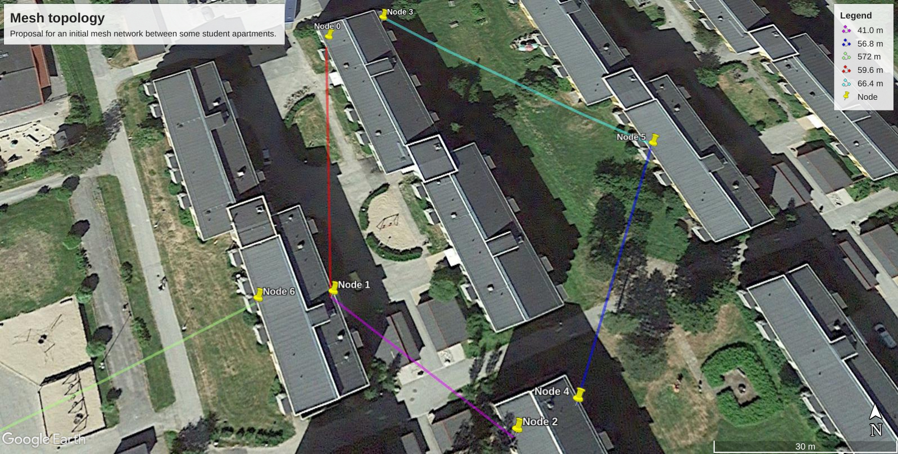

Luleå, Sweden, is actually not that far away from Hyperborea.

_Note: I'm actually talking about the Cjdns mesh network, Hyperboria, not any
[mythical utopia][0]._

<!--more-->

Background
==========

I've been thinking of running a mesh network since ~4 years ago when I and a
classmate had a [school project][1] where we tried to make an Cjdns network that
was easy to join for everyone using a user friendly captive portal.

So, now I'm at it again, and forcing some friends to participate in a
IBSS + B.A.T.M.A.N Advanced + Cjdns _or_ 802.11s + Cjdns network.
I'm still unsure of the stack and looking into alternatives.
The goal I had with the old school project was a distributed and encrypted mesh
network for everyone.
The distributed and encrypted part is even more important today for me as an
European due to the [_Directive on Copyright in the Digital Single Market_][2]
(article 11 and 13) that some [crazy parties][8] in the EU is trying to pass.

Intial mesh topology and plan
=============================
Below is an initial plan for a small mesh network between some student
apartments.

The plan is to start with a test between `Node 0` and `Node 1`, where we test
the throughput and stability of different potential stacks. The other nodes, 2
to 5, will be added one at a time, continuing with the tests (and maybe we'll
come up with new tests). Lastly, there is a `Node 6`, which is a potential link
that could be aimed towards the university. With this link we could get near 1
Gbit/s (with the right hardware) to the Internet. There is also 40 Gbit/s links
to the university that _could_ be connected (wishful thinking).

If we are able to get above 100 Mbit/s speeds and good enough latency the
network could even replace the local ISP's - creating a student ISP that all
students can freely connect to as long as they have the right hardware.

Hardware and drivers
====================
Atheros is by far the best option because of their open source drivers and
stability. The `ath10k` drivers sadly requires [firmware blobs][2], but the
chipsets supports [IEEE 802.11ac][4] which would offer higher throughput than an
`ath9k` and `ath9k_htc` supported [IEEE 802.11a/b/g/n][5] chipset. And maybe the
firmware blob will be liberated in the future [as the ath9k_htc firmware blobs][6]?

Why am I so biased towards the Atheros chipsets? I've had experience with both
the Intel and Realtek chipsets, and there's [_always_][7] a bug that gets in the
way, where Realtek is the worst offender. Intel atleast works, but I get driver
(`iwlwifi`) crashes when running in Ad-Hoc mode sometimes (during association).

[0]: https://en.wikipedia.org/wiki/Hyperborea (Wikipedia: Hyperborea)
[1]: https://github.com/Meshleholm (School project)
[2]: https://en.wikipedia.org/wiki/Directive_on_Copyright_in_the_Digital_Single_Market (Directive on Copyright in the Digital Single Market)
[3]: https://wireless.wiki.kernel.org/en/users/drivers/ath10k/firmware (Atheros ath10k firmware blobs)
[4]: https://en.wikipedia.org/wiki/IEEE_802.11ac (IEEE 802.11ac standard)
[5]: https://en.wikipedia.org/wiki/IEEE_802.11 (IEEE 802.11 standard collection)
[6]: https://wireless.wiki.kernel.org/en/developers/gsoc/2012/ath9k_htc_open_firmware (Linux Wireless: ath9k_htc)
[7]: https://github.com/lwfinger/rtl8188eu/issues/4 (GitHub.com/lwfinger/rtl8188eu: ad-hoc mode issue)
[8]: https://juliareda.eu/2018/09/ep-endorses-upload-filters/ (Julia Reda: European Parliament endorses upload filters and "link tax")

So let's look into some of the Atheros drivers that are interesting.

Drivers overview
================
## Sources
 * Linux Wireless (https://wireless.wiki.kernel.org/en/users/Drivers)
 * WikiDevi (https://wikidevi.com/wiki/Atheros)

## ath9k
 * Completely FOSS, no blobs
 * Both PCI/PCIe and AHB WLAN
 * Driver framework: mac80211
 * MAC architecture: SoftMAC
 * Supported chipsets:
    - AR2427 1×1 SB (no 11n)
    - AR5008:
	AR5418+AR5133
	AR5416+AR5133
	AR5416+AR2133
    - AR9001:
	AR9160 2×2 DB
	AR9102 2×2 SB
	AR9103 3×3 SB
    - AR9002:
	AR9220 2×2 DB
	AR9223 2×2 SB
	AR9227 2×2 SB
	AR9280 2×2 DB
	AR9281 2×2 SB
	AR9285 1×1 SB
	AR9287 2×2 SB
    - AR9003:
	AR9380 3×3 DB
	AR9382 2×2 DB
	AR9331 1×1 SB
	AR9340 2×2 DB
    - AR9004:
	AR9485 1×1 SB
	AR9462 2×2 DB
	AR9565 1×1 SB
	AR9580 3×3 DB
	AR9550 3×3 DB
 * Modes of operation:
    - Station
    - AP
    - IBSS
    - Monitor
    - Mesh point
    - WDS
    - P2P GO/CLIENT
 * Features:
    - 802.11abg
    - 802.11n
    - HT20
    - HT40
    - AMPDU
    - Short GI (Both 20 and 40 MHz)
    - LDPC
    - TX/RX STBC
    - 802.11i
    - WEP 64 / 127
    - WPA1 / WPA2
    - 802.11d
    - 802.11h
    - 802.11w/D7.0
    - WPS
    - WMM
    - LED
    - RFKILL
    - BT co-existence
    - AHB and PCI bus
    - TDLS
    - WoW
    - Antenna Diversity
 * Problems:
    - Tracker: http://bugzilla.kernel.org/buglist.cgi?query_format=specific&order=relevance+desc&bug_status=__open__&product=&content=ath9k

## ath9k_htc
 * Free driver, liberated firmware, no blobs
 * Supported chipsets:
	- AR9271 and AR7010 USB-PCIe bridge with AR928x wireless chips
 * Supported devices:
	- https://wireless.wiki.kernel.org/en/users/drivers/ath9k_htc/devices
 * Driver framework: mac80211
 * MAC architecture: SoftMAC
 * Modes of operation and features:
	- Station Mode
	- Monitor Mode
	- AP Mode (note: AP mode works only with up to 7 stations due to a firmware limitation)
	- IBSS Mode
	- Mesh Mode
	- Legacy (11g) operation
	- HT support
	- TX/RX 11n AMPDU aggregation
	- HW Encryption
	- LED
	- Suspend/Resume
 * Problems:
	- Somewhat young hardware/drivers
	- AP mode limitation of 7 stations
	- Experimental AP/P2P

## ath10K
 * Free driver but requires non-free firmware blob
   (https://wireless.wiki.kernel.org/en/users/drivers/ath10k/firmware)
 * Driver framework: mac80211
 * MAC architecture: SoftMAC
 * Supported chipsets:
	- QCA6164, QCA6164A, QCA6174, QCA6174A, QCA9377, QCA9880,
	- QCA9882, QCA9887, QCA9890, QCA9892 and QCA9980
 * Supported devices:
	- http://wireless.kernel.org/en/users/Drivers/ath10k
 * Modes of operation and features:
	- Station Mode
	- IBSS Mode (partial)
	- AP Mode
	- Mesh Mode (partial)
	- Monitor Mode (partial, firmware dependant)
	- Packet injection (partial, firmware dependant)
 * Problems:
	- Firmware does not support association to the same AP from different virtual STA interfaces (driver prints "ath10k: Failed to add peer XX:XX:XX:XX:XX:XX for VDEV: X" in that case)
	- Packet injection isn't supported yet, applying ath9k regulatory domain hack patch from OpenWRT causes firmware crash (reason: regulatory hint function is never called and ath10k never sends scan channel list to the firmware which in turn causes firmware to crash on scan)
	- Tx rate is reported as 6mbps due to firmware limitation (no tx rate information in tx completions); instead see /sys/kernel/debug/ieee80211/phyX/ath10k/fw_stats
	- Ath10k does NOT support older QCA98xx hw1.0 chips
	- Some of Compex WLE900VX fail to enumerate as PCI device, probably for an electric issue
